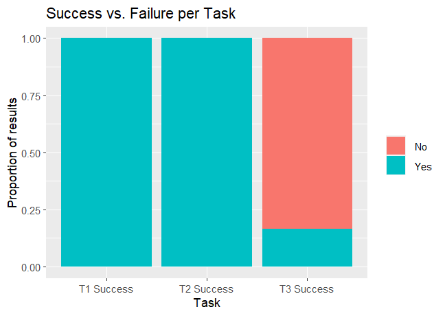

# Phase III: Prototypes and User Testing

## Introduction

!!! Describe the general problem that the project is trying to solve and the focus of this interval of work !!!

## Methods

In phase III, we focused on user testing and user insights of our product. Users were provided with an [interactable prototype](https://xd.adobe.com/view/5711804a-787f-48bf-bb50-08a0bc952959-0242/) ([ pdf ](MMPrototype.pdf)) to provide functionality feedback. The structure of user testing was maintained by a task-based [protocol](Taskprotocol.pdf).

Our participants were first asked for background information about their experience with music streaming platforms to establish baseline data about the participants and their experience and expectations about using the platform. The participants were asked to use "thinking out loud" as well as were asked to rate tasks from 1-5 with 1 being easy and 5 being difficult. 

After the initial background questions, the participants were faced with the first task which was to sign into their streaming platform from our initial music mirror page. From there they were also asked to sign into the secondary streaming platform that they would like to transfer their songs to. After this initial task was completed the participants were then asked to note the order of actions as well as voice concerns or errors they came across. After recording the data of their first task they were asked to score the test based on the level of difficulty from 1 being very easy to 5 being very difficult. 

In the second task of the procedure, the participants were then asked to click the playlist that they wanted to transfer from one streaming platform to then copy the playlist to the secondary streaming platform. After the task was completed or not completed the participants would then be asked about the order of actions taken as well as mistakes made or if they were unsuccessful in completing the task. After the participants responded they would then be asked to rank the ask from 1-5 with 1 being the easiest and 5 being the most difficult. 

Finally in the third task of the procedure participants were asked to look at the list of papers with songs written on it and to use the music mirror platform to create a playlist on the platform. The participants were also asked to carefully look over the list of songs and artists to ensure that the list on the platform corresponded with what was written on the physical list. After the task was run, participants were asked follow-up questions about the task. Data was also recorded on the mistakes in completing the task and the ability to refine the list using Music Mirror. Finally, the participants were asked to score the task difficulty from 1-5. the responses were then collected and put into a spreadsheet with data from all 3 tasks.

At the end of the tasks, the participants were asked a few supplemental questions in a debrief about how they felt about the usability of the platform overall as well as features that they liked and if they did not like any of the features. The participants were also asked if the overall platform performed its essential feature through the use of the minimum viable product. 

Finally, we gathered informal feedback from different software developer teams about their preferences for Music Mirror. The questions are as follows:
* How is the overall look and feel of the app?
* Are 4 alternative search results enough?

## Findings

!!! For each research method, detail each of the findings point-by-point to clarify new discoveries of users' needs !!!

During our usability tests, we recorded data ranging from different variables that dealt with the amount of errors that occurred during each task as well as ratings given from each task based on how well features worked. Using the data we collected during the study we then turned the data into graphs that showed trends that accrued during the study. In the first graph, we compiled all the ratings of each initial task from each participant. Our findings showed that in the first task, people generally felt that completing task 1 was straightforward and there were no responses that conveyed that it was not possible to complete. Furthermore, in the first graph, we found that task 2 followed the same trend of task one with zero failures to complete the task as well as voting that it was very easy. In the third task, our results changed and through the data, it showed that most participants rated the task easy with a larger portion feeling that it was more difficult than the previous 2 tasks.

In the second set of data that was collected which was based on the completion rate of each task, we saw a change in trend from our first set of data. From this graph, the data shows that generally, all participants completed the first two tasks without any problems. Tasks 1 & 2 had 100% completion rates but, where we saw the biggest change was in task 3. From the data, we found that from task 2 to task 3 participants had a difficult time completing the tasks. Our graph shows that out of all the participants, only 1 participant was able to complete the task With task 3 having a 16.67% completion rate. 

## Conclusions

Based on these findings we can comfortably finalize the design of the login feature, as it was quickly identified and used correctly by all participants. However, the widespread failure to notice the text input informs us that we should choose a different method for platform selection, such as the tabs used in a previous iteration. Another conclusion that can be made is that users need more help in noticing mistakes in the song results. While these mistakes can also be attributed to poor task wording or negligence on the user's part, a feature that informs the user of the result's relevance could be helpful. For instance, each search result could have a percentage displayed based on how likely the result is to match the original search. This could also help bring more attention to the search refinement feature, which turned out to be not very noticeable according to the informal feedback collected.

## Caveats
One caveat of our research is that our teams’ participants were exclusively from our UX class. Consequently, this may not represent the music mirror demographic and some users can be overlooked.

Another caveat is that the task given to sign in to platforms was simplified due to the limitation of our prototype not being able to handle authentic sign-in of music streaming platforms. This could have altered user behavior when interacting with our product.

